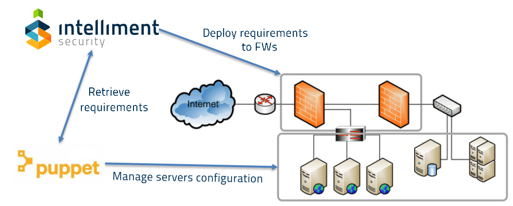
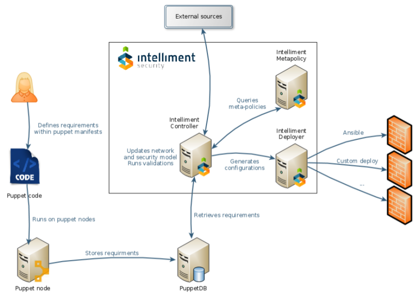

# Puppet Integration

Proof of Concept of Puppet integration with Intelliment Security Policy Automation. This integration shows how to define network visibility requirements as code using Puppet, near the definition for each application component.

### Who can use this integration?

*DevOps* that:

+ Do an advanced configuration management with Puppet
+ Use of applications component profiles and roles
+ Want to automate all aspects of IT management

*Benefits*:

+ Define network visibility requirements with each component of your applications
+ Provision - decomission automatically with each application or component change
+ No need for manual operation to get network visibility
+ Graphical visualization of network visibility changes

## Introduction

This repository contains the following components:

* Puppet module: itlm puppet module found [here](https://github.com/intelliment/puppet-integration/tree/master/puppet/modules/itlm/manifests)
* A web application written in Scala + Play + Angular : A single application that check resources in the PuppetDB and matches with a scenario in order to create requirements according to the _provides_ and _consumes_ stereotypes. This UI also shows inconsistences in case of new requirements violates existing requirements in the scenario.

## How it works

The application built in Scala checks the Puppet nodes reports on PuppetDB to detect changes on visibility requirements. Requirements can be checked against:

+ _Intelliment validators_: to detect issues with the model.
+ _Meta-policies_: pre-defined allows/denies based on standard or custom policies.

Exceptions can start an approval workflow (external sources).

Deployment can be done directly from Intelliment Deployer or delegate to another platform.

## How to run

TBD

## Demo

Following you can see a short video with a demo showing how to define network visibilities using roles and profiles in Puppet and deploying them in a heterogeneous network infrastructure.

If you want more info, please contact us at sales@intellimentsec.com
